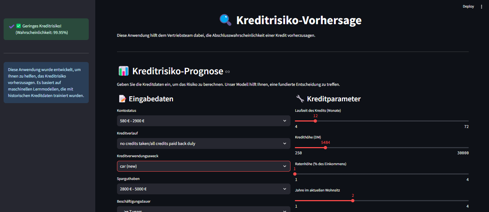

# 💰 Kreditrisiko-Vorhersage mit Machine Learning

## 📄 Projektbeschreibung

Dieses Projekt nutzt verschiedene Machine-Learning-Modelle, um Kreditrisiken vorherzusagen. Die Daten stammen aus dem bekannten "German Credit Dataset" und wurden modernisiert, um realistischere finanzielle Werte widerzuspiegeln. Zudem wurde das Modell mit SMOTE verbessert, um ein ausgewogenes Training zu gewährleisten.

## 📖 Datenvorbereitung

- **Datenquelle**: [German Credit Dataset von Kaggle](https://www.kaggle.com/datasets/arunjangir245/german-credit-card/data)
- **Modifikationen**:
  - Finanzielle Beträge von **DM** in **Euro** umgerechnet

  - Kategorien wie "Status" und "Sparguthaben" an moderne Werte angepasst

  - *One-Hot-Encoding* für kategoriale Features

  - *Standardisierung* numerischer Features

  - *SMOTE* (Synthetic Minority Over-sampling) zur Balance der Klassen

## 📊 Explorative Datenanalyse (EDA)
- **Statistische Zusammenfassungen**: Berechnung von Mittelwert, Median, Standardabweichung etc.
- **Klassenverteilung analysieren**: Untersuchung der Verteilung der Zielvariable.
- **Korrelationen untersuchen**: Analyse der Beziehungen zwischen verschiedenen Merkmalen.
- **Datenvisualisierung**: Erstellung von Histogrammen, Boxplots und Heatmaps zur Identifikation von Mustern und Ausreißern.


## 📊 Modelle und Evaluation

### 🔢 Klassifizierungsmodelle für Kreditrisiko-Vorhersage:

- **Logistische Regression**

- **Random Forest**

- **SVM (Support Vector Machine)**

- **Neurales Netzwerk (MLP)**

- **XGBoost (bestes Modell)**

### 🔍 Bestes Modell: **XGBoost**

- **Accuracy**: 80.50%

- **ROC-AUC-Score**: 73.85%

- **Precision / Recall**: Gute Balance zwischen den Klassen

## 🌟 Deployment mit Streamlit

Zur interaktiven Nutzung wurde eine Streamlit-App entwickelt, mit der Nutzer Kreditrisiken für neue Datenpunkte vorhersagen können.


### 🛠️ Schritte zur Nutzung:

1. **Modell speichern**:
```python
import joblib

joblib.dump(preprocessor, "preprocessor.pkl")
joblib.dump(final_model, "xgb_credit_risk.pkl")
```

2. **Streamlit-App starten**:
```python
streamlit run 'Streamlit_App_XGBoost_Modell.py'
```

## 📚 Dateistruktur
- GermanCredit.csv  # Originaldaten
 
- GermanCredit_eur.csv  # Modernisierte Daten
  
- xgb_credit_risk.pkl  # Gespeichertes XGBoost-Modell
 
- preprocessor.pkl  # Preprocessing-Pipeline
  
- Streamlit_App_XGBoost_Modell.py  # Streamlit-Anwendung für Vorhersagen
  
- explorative_datenanalyse.ipynb  # Datenanalyse, Modelltraining und Vergleich
  
- README.md  # Projektbeschreibung

## 📈 Fazit

Dieses Projekt zeigt, wie Machine Learning für Kreditrisikobewertungen genutzt werden kann. Durch moderne Datenanpassung, Feature-Engineering und Hyperparameter-Tuning wurde ein robustes Modell entwickelt und mit einer benutzerfreundlichen Web-App bereitgestellt.

